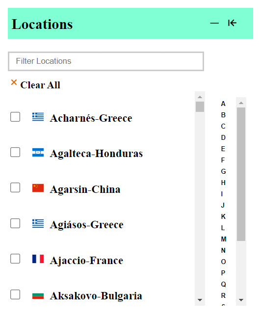
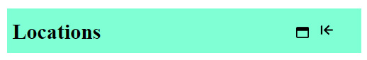
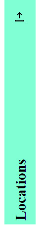

# <u>**Location Facet</u>**
## <u>**Introduction**</u>
The widget is made using the ```ReactJS``` framework. This widget allows users to search for locations by entering the city name in the search box, as well as filter the cities according to the alphabetical letter index. Users can also minimize and maximise the window accodringly.

## <u>**Getting started**</u> 
## **Prerequisites**
* Your device must have ```node``` installed.<br>
* Minimum node version required : v16.15.1
* To install ```node``` [visit here](https://nodejs.org/en/download/)
## **Installation**
* Unzip the folder in your device.
* Open ```Command Prompt(cmd)``` upon right clicking on the unzipped folder.
* Copy and paste the following commands to see the widget.
```
cd widget
npm install
npm start
``` 
* Visit `http://localhost:3000/`

**The project is up and running**


## <u>**Here are some images of running projects**</u>

<p float="left">
  
   &nbsp;  &nbsp; &nbsp;
   
  &nbsp; &nbsp; &nbsp;
  
</p>

<br>

## <center>*************************************************